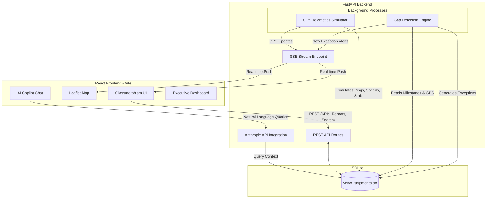

# Volvo Shipment Intelligence 🚛

Volvo Shipment Intelligence is a premium, real-time operational dashboard and backend system designed to track international and domestic freight, predict delays using a gap detection engine, and manage exceptions proactively. It features a conversational AI Copilot (powered by Claude) to interact with supply chain data naturally.

---

## 🌟 Key Features

* **Real-Time Visibility:** Live map tracking of 50 active shipments across 8 lanes (India to Europe, European domestic).
* **Gap Detection Engine:** Background worker that tracks milestones, calculates delays based on elapsed fractions, detects SLA breaches per milestone, and identifies carrier non-compliance and GPS staleness.
* **Proactive Exception Management:** Automated creation of P1 and P2 exceptions (e.g., Missing ASN, Customs Holds, GPS Signal Lost) placed into an actionable queue with an approval workflow.
* **Server-Sent Events (SSE):** Push-based real-time updates for instantaneous map position changes and exception alerts without polling lag.
* **Executive Analytics:** Automated Carrier Scorecards, Lane Performance metrics, and top-level KPIs (OTIF, On-Time Pickup %, Dwell Times).
* **AI Copilot:** Conversational AI that understands the live state of the network, highlighting at-risk shipments, delayed POs, and carrier performance using natural language.
* **Premium Glassmorphism UI:** Built with React and Tailwind CSS, featuring glowing risk thresholds, animated counting KPIs, and pulsing Leaflet map markers.

---

## 🏗️ System Architecture & Flow

The system is split into a **React/Tailwind Frontend** and a **FastAPI/Python Backend**.



---

## 🚀 Getting Started

### Prerequisites
* **Node.js** (v18+)
* **Python** (3.10+)
* **Anthropic API Key** (for Copilot functionality)

### 1. Backend Setup

1. Navigate to the backend directory:
   ```bash
   cd backend
   ```
2. Create a virtual environment and install dependencies (if not already done):
   ```bash
   python -m venv venv
   source venv/bin/activate  # On Windows: .\venv\Scripts\activate
   pip install -r requirements.txt
   ```
3. Set up your `.env` file (copy from `.env.example`):
   ```bash
   cp .env.example .env
   ```
   Add your `ANTHROPIC_API_KEY` to the `.env` file.
4. Run the FastAPI server:
   ```bash
   python -m uvicorn app.main:app --host 0.0.0.0 --port 8000 --reload
   ```
   *(Note: The SQLite database is created and seeded automatically on first run).*

### 2. Frontend Setup

1. Navigate to the frontend directory:
   ```bash
   cd frontend
   ```
2. Install dependencies:
   ```bash
   npm install
   ```
3. Run the Vite development server:
   ```bash
   npm run dev
   ```
4. Open your browser and navigate to **http://localhost:5173**.

---

## 🛠️ Technology Stack

* **Frontend:** React, TypeScript, Tailwind CSS, React-Leaflet, Vite.
* **Backend:** Python, FastAPI, SQLAlchemy, Pydantic, asyncio.
* **Database:** SQLite (designed for easy migration to PostgreSQL).
* **AI:** Anthropic Claude 3.5 Haiku (via `anthropic` SDK).

---

## 📝 Exception Types Handled

* `MISSING_ASN`: Supplier failed to send Advance Shipping Notice before pickup.
* `MISSING_PICKUP`: Carrier failed to confirm pickup within SLA.
* `GPS_OFFLINE` / `GPS_OFFLINE_CRITICAL`: Telematics device stopped reporting coordinates (simulated).
* `DELAY_RISK_HIGH`: Shipment is projected to miss the delivery window based on current speed and distance.
* `CUSTOMS_HOLD`: Cross-border shipment held at customs (seeded).
* `CARRIER_NON_COMPLIANT`: Carrier missed critical update windows.
* `MILESTONE_SLA_BREACH`: Generic SLA breach for events like Gate Arrival or Dock Check-in.
