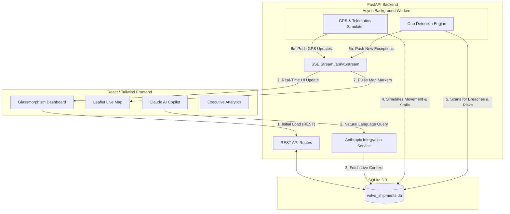

<div align="center">
  <h1>Volvo Shipment Intelligence Platform</h1>
  <p><strong>A Next-Generation Freight Tracking & Proactive Exception Management System</strong></p>
</div>

---

## 📖 Overview

The **Volvo Shipment Intelligence Platform** is a sophisticated, real-time supply chain dashboard designed to solve the "black box" problem of international and domestic freight tracking. Moving beyond simple point-A-to-point-B tracking, this platform introduces a **Gap Detection Engine** that proactively calculates delay risks, tracks per-milestone Service Level Agreements (SLAs), and alerts operators to supply chain anomalies *before* they result in line stoppages.

### The Business Value
In JIT (Just-In-Time) and JIS (Just-In-Sequence) manufacturing, a delayed truck or a missing customs document can cost thousands of dollars per minute in line stoppages. This platform transitions operations from **reactive firefighting** to **proactive management** by automatically flagging high-risk shipments, enforcing carrier compliance, and providing an AI Copilot to answer complex logistical questions instantly.

---

## ✨ Core Capabilities

### 1. 🧠 Gap Detection & Risk Scoring Engine
A continuous background worker that analyzes the health of every active shipment:
- **Milestone SLA Tracking:** Flags shipments if specific milestones (e.g., `PICKUP_COMPLETED`, `GATE_ARRIVAL`) are not met within expected time windows.
- **Carrier Compliance Penalty:** Automatically penalizes the health score of shipments where the carrier failed to provide mandatory updates.
- **GPS Anomaly Detection:** Flags shipments if the GPS signal goes stale (>45 mins) or if consecutive signal gaps suggest telematics device tampering or failure.
- **Criticality Weighting:** Applies heavier risk multipliers to `JIT` and `JIS` shipments compared to `STANDARD` freight.

### 2. ⚡ Real-Time Operations (SSE Push)
Unlike legacy dashboards that require manual refreshes, this platform utilizes **Server-Sent Events (SSE)**. As the background simulator generates new GPS pings or the Gap Engine uncovers new exceptions, they are pushed instantly to the frontend.
- **Pulsing Risk Radars:** Map markers for at-risk shipments pulse in real-time.
- **Instant Alerts:** P1 (Critical) exceptions slide into the Exception Queue with a red flash without a page reload.

### 3. 🤖 AI Supply Chain Copilot
Powered by **Anthropic Claude 3.5**, the copilot has full context of the live database. 
- Ask natural language questions like: *"Which JIT shipments to Gothenburg are at risk today?"* or *"How is DHL Freight performing this week?"*
- Maintains conversation history for follow-up questions.
- Injects live ETA, confidence scores, and missing milestone data into the prompt for hyper-accurate answers.

### 4. 📊 Executive Analytics Dashboard
A dedicated view for supply chain managers to assess network health:
- **OTIF (On-Time In-Full) & On-Time Pickup Tracking.**
- **Carrier Scorecards:** Sortable tables showing compliance rates, on-time delivery rates, and P1 exception counts per carrier.
- **Lane Performance:** Identifies the riskiest transit corridors (e.g., *Mumbai → Gothenburg*) and their average milestone completeness.

---

## 🏗️ System Architecture & Data Flow



### Component Breakdown
1. **Frontend (`/frontend`)**: Built with React, Vite, and Tailwind CSS. Uses heavy custom CSS properties (`index.css`) to achieve a premium "glassmorphism" aesthetic with deep Volvo-branded colors.
2. **Backend (`/backend`)**: A robust FastAPI application utilizing SQLAlchemy ORM. 
3. **Database**: Currently utilizes SQLite for zero-configuration hackathon deployment, but the SQLAlchemy ORM makes it trivially portable to PostgreSQL.

---

## 🚀 Installation & Setup Guide

Follow these steps to run the platform locally on your machine.

### Prerequisites
- Node.js (v18 or higher)
- Python (3.10 or higher)
- An Anthropic API Key (for the Copilot)

### Step 1: Backend Setup
Open a terminal and navigate to the backend directory:
```bash
cd backend
```

Create and activate a Python virtual environment:
```bash
# Windows
python -m venv venv
.\venv\Scripts\activate

# macOS/Linux
python3 -m venv venv
source venv/bin/activate
```

Install the required Python packages:
```bash
pip install -r requirements.txt
```

Create your environment file:
1. Rename `.env.example` to `.env`.
2. Open `.env` and add your Claude API key to `ANTHROPIC_API_KEY=your_key_here`.

Start the FastAPI server:
```bash
python -m uvicorn app.main:app --host 0.0.0.0 --port 8000 --reload
```
*Note: On the very first run, the system will automatically create `volvo_shipments.db` and securely seed it with 50 active shipments, historical milestones, and pre-calculated GPS routes.*

### Step 2: Frontend Setup
Open a **new** terminal and navigate to the frontend directory:
```bash
cd frontend
```

Install the Node modules:
```bash
npm install
```

Start the Vite development server:
```bash
npm run dev
```

### Step 3: View the App
Open your web browser and navigate to **[http://localhost:5173](http://localhost:5173)**.

---

## 🖥️ Usage Walkthrough

1. **Operations Tab:** 
   - **Shipment List:** Use the search bar to filter by PO number, Supplier, or Carrier. Use the filter pills to isolate `AT_RISK` or `JIT` shipments.
   - **Shipment Map:** Click any shipment in the list to highlight its full route on the Leaflet map. A dashed line represents the predicted future trajectory. High-risk shipments will feature a red, pulsing radar ring.
   - **Detail Panel:** Once a shipment is selected, the right panel displays a circular ETA confidence gauge and a vertical milestone timeline indicating exactly which steps (e.g., *Dock Check-in*, *Customs Clearance*) have been completed.
   - **Exception Queue:** Review P1 and P2 alerts generated by the Gap Detection Engine. Click an exception to expand it, view the root cause, and click **Approve Action** to log the system's recommended resolution.

2. **Executive Tab:** 
   - View top-level network health, including the current OTIF percentage.
   - Review Carrier Scorecards to see which transport providers are failing to meet compliance SLAs.

3. **AI Copilot:** 
   - Located in the bottom right of the Operations tab. Try clicking one of the suggested queries, or type: *"What is the status of PO 4500120035?"*

---

## 📡 API Endpoints Overview

The backend exposes a fully documented Swagger UI. While the server is running, visit **http://localhost:8000/docs** to interact with the API.

| Endpoint | Method | Description |
|---|---|---|
| `/api/v1/shipments` | GET | Paginated, sortable, and searchable list of shipments. |
| `/api/v1/shipments/{id}/eta` | GET | Returns the predicted delivery time and confidence score. |
| `/api/v1/exceptions` | GET | Lists all active exceptions ranked by business impact score. |
| `/api/v1/reports/carrier-scorecards` | GET | Aggregates compliance and on-time data grouped by carrier. |
| `/api/v1/stream` | GET | SSE stream that pushes JSON payloads on GPS updates or new alerts. |

---

## 🗺️ Future Roadmap (Production Readiness)
While this MVP is fully functional, moving it to production would involve:
1. **Database Migration:** Swapping SQLite for **PostgreSQL**.
2. **Event Streaming:** Replacing the internal Python `asyncio.Queue` with **Apache Kafka** to handle millions of telematics pings.
3. **Containerization:** Wrapping the frontend and backend in Docker containers and orchestrating via Kubernetes (Helm charts).
