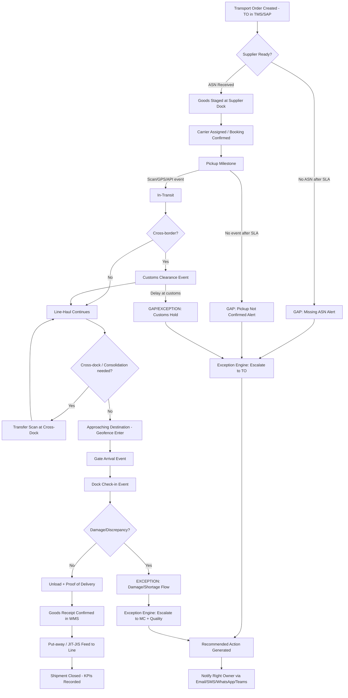
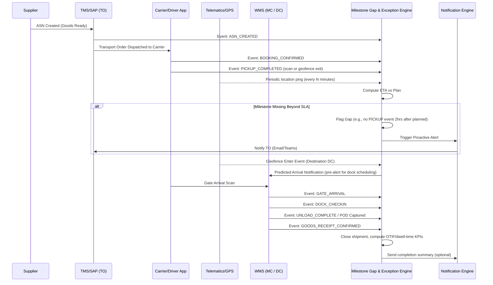
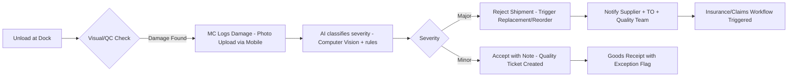
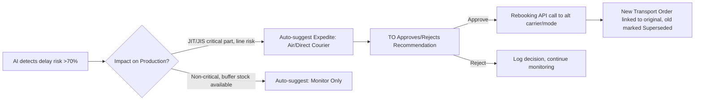
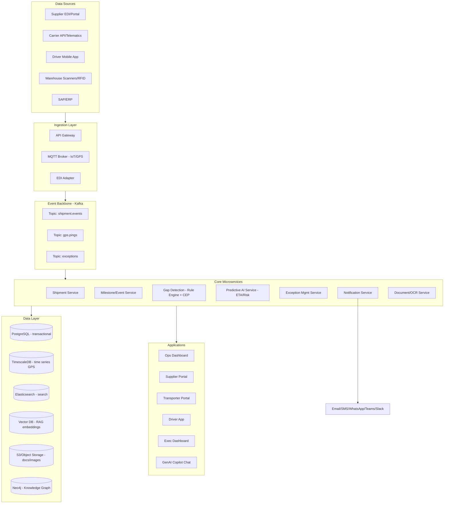
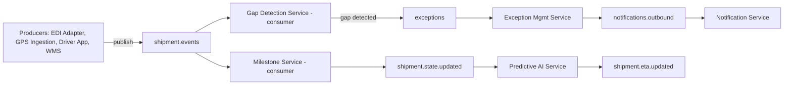
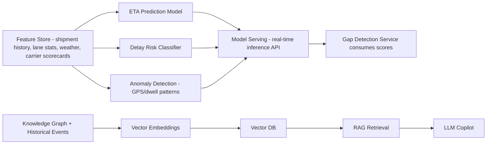
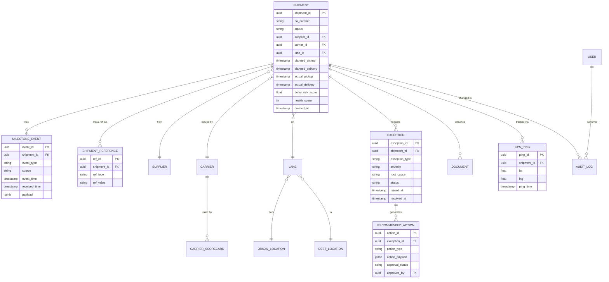
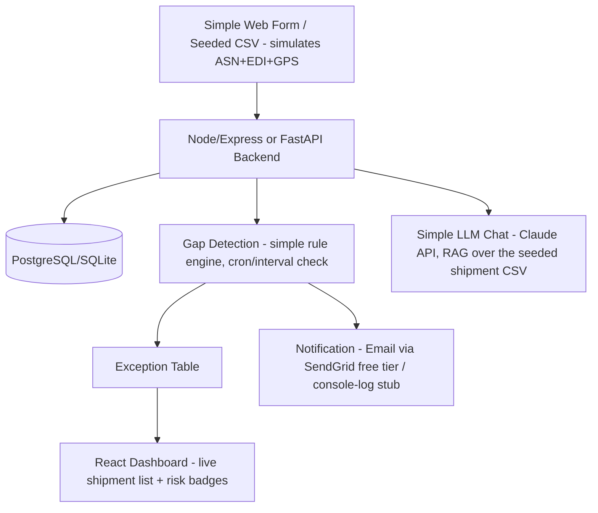

# Volvo Shipment Tracking & Operational Visibility Platform
### Enterprise Solution Architecture, AI Design, and Hackathon Build Plan

**Prepared for:** ISRO-style hackathon deliverable / Volvo Problem Statement — Shipment Tracking & Operational Visibility
**Author role:** Senior Solution Architect, Supply Chain Consultant, Enterprise Software Architect, AI Engineer
**Scope:** Production-grade design + 24-48hr hackathon MVP

**A note on terminology (stated assumption):** Volvo's internal logistics vocabulary uses several abbreviations that aren't universally standardized outside the company. For this document I use the most common industry interpretation, and you should swap in Volvo's exact internal definitions if your mentor/judges clarify otherwise:
- **TO = Transport Organizer/Operator** — the internal Volvo logistics planner who books, tenders, and administers a transport order (creates the "Transport Order" in TMS, assigns lanes/carriers, owns the shipment from a planning perspective).
- **MC = Material Coordinator / Motor Carrier coordinator** — the person (often plant-side or DC-side) responsible for materials availability, dock scheduling, and coordinating physical handover of goods to/from the carrier. In some Volvo documentation MC also refers to "Motor Carrier" (the trucking company itself); where that distinction matters I call the trucking company **"Transporter/Carrier"** to avoid ambiguity.
- **Supplier** — Tier 1/2/3 vendor supplying parts/components/CKD kits to Volvo factories.
- **Transporter** — the logistics service provider (LSP) / carrier executing road, rail, sea, or air movement.
- **Warehouse** — supplier-side or Volvo-side consolidation/staging point (could be a Volvo-owned DC, a 3PL cross-dock, or a supplier's outbound warehouse).
- **Distribution Center (DC)** — a Volvo-owned or 3PL-operated regional hub that receives consolidated freight and redistributes to plants or dealers.
- **Customer** — internal (an assembly plant needing parts JIT/JIS) or external (a dealer/end customer receiving a finished vehicle or spare part).

---

## 1. Understanding the Business Problem

### 1.1 The Logistics Workflow (End-to-End)

Volvo's inbound and outbound logistics network is a multi-tier, multi-modal chain. A single part can pass through 4-7 handoffs before it reaches an assembly line or a dealer. The canonical flow looks like this:

```
Supplier Plant → Supplier Warehouse (staging) → Inbound Transport (Road/Rail/Sea/Air)
   → Cross-Dock / Consolidation Center → Line-Haul Transport
   → Distribution Center (DC) / Volvo Plant Receiving Dock → Put-away / Line-side (JIT/JIS)
   → [For outbound] Finished Vehicle/Parts → Outbound DC → Last-Mile Transport → Dealer/Customer
```

At every arrow above there is a **physical handoff** and, ideally, a **corresponding digital milestone event**. In practice, the physical handoff almost always happens; the digital event frequently does not, or happens late, or is entered against the wrong reference number. That gap between "physical reality" and "system reality" is the entire problem statement.

### 1.2 Who the Stakeholders Are

| Stakeholder | Role | Systems they touch | Pain today |
|---|---|---|---|
| **TO (Transport Organizer)** | Plans transport orders, books capacity with carriers, sets expected milestones/ETAs, monitors exceptions | TMS (Transport Management System), ERP (SAP), Excel trackers | Spends 60-70% of time chasing status via phone/email instead of managing exceptions |
| **MC (Material Coordinator)** | Confirms material readiness, manages dock/gate scheduling, confirms goods receipt | WMS, SAP MM, dock scheduling tools | Doesn't know a truck is arriving until it's at the gate; can't pre-stage dock/labor |
| **Supplier** | Produces and stages goods, hands off to carrier, generates ASN (Advance Shipping Notice) | Supplier portal, EDI 856/ASN, sometimes just email/fax | Manual ASN creation, no visibility once goods leave their dock |
| **Transporter/Carrier** | Physically moves goods, should scan/report milestones (pickup, in-transit, customs, delivery) | Carrier TMS, driver mobile apps, telematics/GPS units | Drivers under time pressure skip app updates; connectivity gaps in transit; incentive misalignment (paid per load, not per data quality) |
| **Warehouse/DC operators** | Receive, cross-dock, stage, dispatch | WMS, barcode/RFID scanners | Manual paperwork at receiving, backlog during peak, no real-time WMS-TMS sync |
| **Customer (plant/dealer)** | Consumes the shipment | MRP/production scheduling, dealer DMS | Line-stoppage risk if JIT/JIS parts don't arrive on time; no early warning |

### 1.3 How Shipment Tracking Currently Works (As-Is)

Today's process is a patchwork of **push (EDI/API where integrated) + pull (manual phone/email follow-up where not integrated)**:

1. TO creates a Transport Order in the TMS/SAP with an expected pickup date, expected delivery date, and a defined milestone template (e.g., "Booked → Picked Up → In Transit → Customs → Arrived at DC → Delivered").
2. Supplier is expected to send an ASN (via EDI 856 or a portal) once goods are ready — this step is inconsistent; smaller Tier 2/3 suppliers often don't have EDI capability and rely on email attachments or manual portal entry, which get delayed or skipped.
3. Carrier is expected to scan/report each milestone. Large carriers with integrated telematics (e.g., a GPS unit reporting to a platform like project44, FourKites, or a proprietary Volvo system) report automatically. Smaller regional carriers, owner-operators, or manual-scan operations report late, incompletely, or not at all.
4. When a milestone is missing or a shipment appears "stuck," the TO or MC has no system-driven alert — they only notice when someone downstream asks "where is my truck?" This triggers a manual escalation: phone call to the carrier dispatcher → phone call to the driver → email to the supplier → update (maybe) in a shared Excel tracker.
5. Exception resolution (reroute, expedite, replace via air freight) is decided ad hoc, based on whoever escalates loudest, not on a systematic risk score.

### 1.4 Why Manual Follow-Ups Happen

- **Fragmented systems of record.** ASN comes from the supplier's system, milestone scans come from the carrier's system (or not at all), GPS comes from a telematics provider, and goods-receipt confirmation comes from the WMS. There is no single shipment-centric event store that stitches these together in real time.
- **Inconsistent EDI/API maturity across the carrier and supplier base.** A Tier 1 global carrier might have full API/EDI integration; a regional owner-operator carrier may have none. Volvo's supplier/carrier base spans both extremes across multiple countries (customs, language, and regulatory differences compound this).
- **No proactive exception engine.** Even where data exists, nobody is computing "this shipment is 40% through its expected transit time but has moved 0% of the distance" — so early warning doesn't happen; problems surface only when it's already late.
- **Human incentive misalignment.** Drivers are paid to drive, not to tap a phone screen. App-based milestone reporting has poor compliance unless it's near-zero-friction (auto geofence trigger, not manual button-press).
- **Reference number mismatches.** A shipment might be tracked as a PO number in SAP, a Bill of Lading number by the carrier, and a load number by the driver app. Without a canonical shipment ID and cross-reference table, event data that *does* exist can't be automatically linked to the right shipment.

### 1.5 Where the Visibility Gaps Occur (Precisely)

Mapping the flow in 1.1 against real milestone events, the highest-frequency gap points are:

1. **Supplier dock → carrier pickup**: ASN not sent or sent late; "goods ready" event missing.
2. **Carrier pickup → in-transit**: no GPS ping (device malfunction, low battery, tunnel/rural signal gap), or driver app milestone not tapped.
3. **Border/customs crossing** (for cross-border EU/international lanes): customs clearance event often only available via customs broker email, not integrated into TMS.
4. **Cross-dock/consolidation handoff**: goods physically re-load onto a second truck; the "transfer" event is frequently un-scanned because it's an internal warehouse process not tied to the original shipment ID.
5. **DC/Plant gate arrival → dock check-in**: gate arrival time and dock check-in time are different (a truck can queue for hours) — this differential is rarely captured, hiding real detention/dwell time.
6. **Goods receipt confirmation**: WMS receipt often lags actual unloading by hours because of manual counting/QC steps.

### 1.6 Pain Points (Consolidated)

- Operations teams spend the majority of their working time on **status-chasing phone calls and emails** rather than managing genuine exceptions.
- **Reactive, not proactive**: problems are discovered after they've already caused impact (line stoppage risk, missed customer delivery window) rather than being flagged early enough to act.
- **No single source of truth**: TO, MC, supplier, and transporter each have a partial and sometimes conflicting view of shipment status.
- **No systematic root-cause visibility**: the business can't answer "which lanes/carriers/suppliers cause the most missing-milestone incidents" because the data needed to compute that doesn't exist in one place.
- **Poor customer/plant communication**: downstream stakeholders (assembly line planners, dealers) get informed of delays too late to mitigate (e.g., can't pull from safety stock, can't reschedule production sequence).

### 1.7 Root Causes (Technical, Not Just Process)

| Root cause | Category |
|---|---|
| No canonical shipment/event data model shared across supplier, carrier, and Volvo systems | Data architecture |
| No real-time event ingestion layer (batch EDI runs overnight; anything happening intraday is invisible until next batch) | Integration architecture |
| No rules/ML engine computing expected-vs-actual milestone timing | Analytics/AI gap |
| No unified notification/escalation layer — alerts (where they exist) live in silos per system | Application gap |
| Manual, non-standardized data capture at the edge (paper, phone calls, inconsistent driver app usage) | Process/UX gap |
| No incentive or friction-minimized capture mechanism for small carriers/drivers | Change management gap |

### 1.8 Current Industry Solutions

- **Real-time visibility platforms**: project44, FourKites, Transporeon (now part of Trimble), Overhaul — these aggregate carrier telematics, EDI, and geofencing to produce a real-time shipment map and predictive ETA.
- **TMS-native tracking**: SAP TM, Oracle OTM, Blue Yonder TMS — these manage the transport order lifecycle but usually rely on external visibility providers or carrier EDI for actual location/status.
- **IoT/telematics providers**: Samsara, Geotab, traditional truck OEM telematics (relevant for Volvo Trucks itself) — GPS + sensor data (temperature, door open/close) at the vehicle/trailer level.
- **EDI/ASN networks**: traditional EDI VANs (SPS Commerce, TrueCommerce) connecting supplier ERPs to Volvo's SAP.

### 1.9 Why Existing (Purchased) Systems Still Fail Here

- They are **carrier/lane-coverage dependent** — a platform like FourKites is excellent when the carrier has a supported telematics integration; it does nothing for the long tail of small regional carriers and manual-scan warehouses that make up a meaningful share of Volvo's supplier/carrier base, especially in emerging markets and Tier 2/3 supplier lanes.
- They are typically **generic multi-customer SaaS**, not tuned to Volvo's specific milestone taxonomy, JIT/JIS production risk model, or internal systems (SAP variant, plant calendars, dealer DMS).
- They solve **visibility** (where is it) reasonably well but are weaker on **prescriptive exception handling** — i.e., turning "this shipment is going to be late" into an automated, ranked, actionable recommendation routed to the right person with the right urgency, tied into Volvo's own escalation and stock-cover logic.
- Licensing costs scale with shipment volume and carrier connections, so **long-tail coverage is often descoped** for cost reasons — precisely the segment causing most of the manual follow-up pain today.

**Design implication for our solution:** we do not try to replace GPS/telematics hardware. We build a **milestone/event ingestion and gap-detection + AI exception layer** that sits on top of whatever data sources exist (EDI, API, driver app, manual entry, GPS), fills the "expected event never arrived" gap with predictive/inferred state, and drives proactive alerts and recommended actions — this is exactly the segment of the problem that off-the-shelf platforms under-serve for Volvo's long-tail lanes.


---

## 2. Business Process Mapping

### 2.1 End-to-End Flow (Swimlane Concept, Text Form)

```
Supplier          Factory/Supplier WH     Transporter            DC / Volvo Plant        Customer/Line
   |                      |                     |                        |                     |
   |--Produce goods------>|                     |                        |                     |
   |                      |--Stage & pack------>|                        |                     |
   |                      |--Generate ASN------>|                        |                     |
   |                      |<--Book pickup--------|                       |                     |
   |                      |--Goods handed over-->|                       |                     |
   |                      |                     |--In-transit scans----->|                     |
   |                      |                     |--Customs (if x-border)>|                     |
   |                      |                     |--Arrive gate---------->|                     |
   |                      |                     |--Dock check-in-------->|                     |
   |                      |                     |--Unload/POD----------->|                     |
   |                      |                     |                        |--GR confirm in WMS->|
   |                      |                     |                        |--Put-away/JIT feed->|
   |                      |                     |                        |                    -->Line/Customer receives
```

### 2.2 Mermaid — Master Shipment Lifecycle (Flowchart)



### 2.3 Mermaid — Milestone & Event Taxonomy Sequence Diagram



### 2.4 Exception Sub-Flows

**Damaged Shipment Flow:**


**Rerouting / Delay Exception Flow:**


### 2.5 Full Milestone Event Catalog

| # | Milestone/Event | Typical Source | Mandatory? |
|---|---|---|---|
| 1 | Transport Order Created | TMS/SAP | Yes |
| 2 | ASN / Goods Ready | Supplier portal / EDI 856 | Yes |
| 3 | Carrier Booking Confirmed | TMS / Carrier API | Yes |
| 4 | Pickup Completed | Driver app / geofence exit / scan | Yes |
| 5 | In-Transit Ping | GPS/Telematics | Recurring |
| 6 | Border/Customs Entry | Customs broker feed | If cross-border |
| 7 | Border/Customs Cleared | Customs broker feed | If cross-border |
| 8 | Cross-Dock Transfer In/Out | WMS scan | If applicable |
| 9 | Geofence Enter (Destination) | GPS | Yes |
| 10 | Gate Arrival | Gate scanner / driver app | Yes |
| 11 | Dock Check-in | WMS | Yes |
| 12 | Unload Start/Complete | WMS / handheld scanner | Yes |
| 13 | Proof of Delivery (signature/photo) | Driver app / MC mobile | Yes |
| 14 | Goods Receipt Confirmed | WMS/SAP MM | Yes |
| 15 | Damage/Discrepancy Logged | MC mobile app | Conditional |
| 16 | Put-away Complete | WMS | Yes |
| 17 | Shipment Closed | System (auto) | Yes |


---

## 3. Functional Requirements

Grouped by module so they map directly to microservices later.

### 3.1 Shipment & Order Management
- FR-01: Create/edit/cancel Transport Orders (manual or via SAP/ERP sync).
- FR-02: Auto-generate canonical Shipment ID and maintain cross-reference table (PO#, BOL#, Load#, ASN#, Carrier reference#).
- FR-03: Assign/reassign carrier and mode (road/rail/sea/air) to a shipment.
- FR-04: Define expected milestone template per lane/mode (configurable, not hardcoded).
- FR-05: Bulk import shipments (CSV/EDI/API).
- FR-06: Link/merge/split shipments (partial loads, consolidated loads).

### 3.2 Tracking & Milestone Capture
- FR-07: Ingest GPS/telematics pings (via API/webhook/MQTT).
- FR-08: Ingest EDI 856 (ASN), 214 (shipment status), 990/997 (acknowledgements).
- FR-09: Mobile driver app for manual milestone confirmation (low-friction: single tap + auto geofence).
- FR-10: Barcode/QR/RFID scan capture at warehouse/dock/cross-dock.
- FR-11: Geofencing engine — auto-trigger milestone events on entry/exit of defined zones (supplier dock, DC, customs zone).
- FR-12: Manual milestone override/entry (for long-tail no-integration carriers) via simple web form or WhatsApp bot.

### 3.3 Predictive & Gap Detection
- FR-13: ETA prediction per shipment (dynamic, recalculated on each new event).
- FR-14: Delay-risk scoring (0-100) per shipment, refreshed continuously.
- FR-15: Missing-milestone detection — flag any shipment where an expected event hasn't arrived within SLA window.
- FR-16: Shipment Health Score combining ETA confidence, milestone completeness, and anomaly signals.
- FR-17: Root-cause tagging — auto-classify why a gap/delay occurred (GPS offline, carrier non-compliance, customs, weather, etc.) using rules + ML.

### 3.4 Alerts, Notifications & Exception Management
- FR-18: Configurable alert rules (per lane, per part-criticality, per customer).
- FR-19: Multi-channel notification: Email, SMS, WhatsApp Business API, Microsoft Teams, Slack, in-app push.
- FR-20: Escalation matrix (L1 → L2 → L3 based on time-to-acknowledge and severity).
- FR-21: Exception workspace — single screen listing all active exceptions ranked by business impact (JIT/JIS criticality × delay probability).
- FR-22: Recommended-action engine (suggest reroute, expedite, alternate carrier, safety-stock pull).
- FR-23: One-click action approval workflow (TO/MC approves AI recommendation, system executes rebooking via API where possible).

### 3.5 Portals & Apps
- FR-24: Admin Portal — user/role management, master data (lanes, carriers, suppliers, DCs), alert rule configuration.
- FR-25: Operations (TO/MC) Dashboard — live shipment map, exception queue, KPI widgets.
- FR-26: Supplier Portal — ASN creation, shipment status visibility, document upload.
- FR-27: Transporter Portal — assigned loads, milestone confirmation, POD upload, capacity/booking response.
- FR-28: Driver Mobile App (Android/iOS/PWA) — turn-by-turn assigned load, one-tap milestone confirm, photo/POD capture, offline-first with sync-on-reconnect.
- FR-29: Executive Dashboard — network-level KPIs (OTIF, dwell time, exception volume, cost impact) with drill-down.

### 3.6 Reporting, Search & Audit
- FR-30: Full-text and filtered search across shipments (by PO, BOL, supplier, carrier, plant, date range, status).
- FR-31: Scheduled and ad-hoc reports (OTIF, on-time pickup %, missing-milestone %, dwell time by DC, carrier scorecards).
- FR-32: Immutable audit log of every status change, who/what system made it, and timestamp.
- FR-33: Data export (CSV/Excel/PDF) for all reports and shipment lists.

### 3.7 Document & Media
- FR-34: Document upload/storage (ASN, invoice, customs docs, POD) linked to shipment.
- FR-35: Image/photo upload for damage documentation and POD, with metadata (GPS+timestamp) capture.
- FR-36: OCR extraction from uploaded documents (e.g., extract BOL number from a scanned PDF) to auto-link to shipment.

### 3.8 Integration
- FR-37: REST/GraphQL API for all core entities (shipments, events, exceptions).
- FR-38: Webhook subscription system for external systems to receive real-time event pushes.
- FR-39: SAP/ERP connector (IDoc or OData/RFC) for TO creation and GR posting.
- FR-40: Generic EDI adapter (X12/EDIFACT) for suppliers/carriers using traditional EDI.
- FR-41: Telematics provider adapter framework (pluggable connectors: Samsara, Geotab, project44, custom GPS device APIs).

### 3.9 AI / Copilot
- FR-42: Natural-language chat assistant ("Where is PO 4500123456?", "Which shipments are at risk today?") backed by RAG over shipment/event data.
- FR-43: Agentic exception resolution — AI agent can autonomously check alternate carrier availability, draft a reroute recommendation, and present it for one-click human approval (human-in-the-loop, not fully autonomous execution for cost-impacting actions).
- FR-44: Document understanding — auto-classify and extract structured fields from uploaded shipping documents.


---

## 4. Non-Functional Requirements

| Category | Requirement | Target/Detail |
|---|---|---|
| **Scalability** | Handle Volvo's global shipment volume | Design for 500K–2M active shipments/year across regions; horizontally scalable microservices; event ingestion must handle bursty GPS ping traffic (10K+ events/sec at peak across the fleet) |
| **High Availability** | Core tracking & alerting must not go down | 99.9% uptime SLA for ingestion + alerting path; multi-AZ deployment; graceful degradation (if AI scoring service is down, raw milestone tracking still works) |
| **Latency** | Real-time feel for ops teams | Event ingestion-to-dashboard update < 5 seconds (p95); alert generation-to-notification-sent < 30 seconds (p95) |
| **Security** | Protect commercially sensitive logistics data | TLS 1.3 in transit, AES-256 at rest, secrets in vault (not in code/config), least-privilege IAM |
| **Performance** | Dashboard responsiveness | Dashboard initial load < 2s, filter/search response < 1s for up to 100K shipment result sets (via pagination + indexed search) |
| **Encryption** | Data protection | Field-level encryption for PII (driver names/phone numbers), database-level encryption at rest, encrypted backups |
| **Authentication** | Identity | OAuth2/OIDC via Volvo's corporate identity provider (Azure AD/Entra ID) for internal users; separate scoped auth for supplier/carrier external portal users |
| **Authorization** | Access control | RBAC with attribute-based scoping (a TO only sees their region/plant's shipments unless granted broader access) |
| **Compliance** | Regulatory | GDPR (EU operations, driver personal data), SOC2 Type II posture for the platform, customs data handling per country regulations |
| **Logging** | Observability | Structured JSON logs, correlation ID per shipment/request, centralized log aggregation |
| **Monitoring** | Operational health | Golden signals (latency, traffic, errors, saturation) per microservice; business KPI monitoring (missing-milestone rate, alert delivery success rate) |
| **Disaster Recovery** | Business continuity | RPO ≤ 15 minutes, RTO ≤ 1 hour for core tracking services; cross-region backup |
| **Backup** | Data durability | Automated daily full + continuous incremental backups, 30-day retention minimum, tested restore quarterly |
| **Fault Tolerance** | Resilience | Circuit breakers on all external integrations (carrier APIs, EDI VAN, SAP); retry with exponential backoff; dead-letter queues for unprocessable events |
| **Cloud Readiness** | Portability | Containerized (Docker/Kubernetes), infrastructure-as-code (Terraform), cloud-agnostic where feasible (avoid deep lock-in on proprietary managed services where an open alternative exists) |
| **Data Retention** | Storage lifecycle | Hot data (active + 90 days) in primary DB; cold/historical data (>90 days) archived to object storage/data lake for analytics, at lower cost |
| **Internationalization** | Global operations | Multi-language UI (at least EN, SV, DE, FR, ZH given Volvo's footprint), multi-timezone handling (all timestamps stored UTC, displayed local) |
| **Accessibility** | Usability | WCAG 2.1 AA compliance for web portals |


---

## 5. Gap Analysis — Every Reason a Milestone Goes Missing

| Gap | Cause | Impact | Solution |
|---|---|---|---|
| GPS offline | Device malfunction, dead battery, tunnel/rural dead zone | Blind spot in transit visibility | Interpolate position from last-known + speed/ETA model; flag as "stale GPS" after N minutes; fallback to driver-app manual ping |
| Driver forgot to update | High friction, time pressure | Milestone never fires even though physically happened | Auto-trigger via geofence instead of manual button; reduce to true one-tap where manual is unavoidable |
| Supplier delay | Production/staging behind schedule | Late ASN, downstream cascading delay | Proactive ASN-due reminders; auto-escalate if ASN SLA missed by X hours |
| ERP sync failed | SAP interface downtime/batch failure | TO not created/updated in tracking system | Retry queue + DLQ + alert on integration failure; reconciliation job comparing SAP vs tracking DB nightly |
| API timeout | Carrier/telematics API flaky | Missing event | Circuit breaker + retry with backoff; queue and replay |
| IoT disconnected | Sensor/telematics unit offline | No location/temp data | Redundant ping sources (driver app as backup); alert if silence > SLA |
| Wrong shipment ID | Manual entry error, non-standard reference | Event exists but unlinked | Fuzzy-match/cross-reference table; OCR-based auto-link from scanned docs |
| Network issue | Poor cellular coverage in transit corridor | Delayed batch of events | Offline-first mobile app design with local queue + sync on reconnect |
| Human error | Manual paperwork, transcription mistakes | Incorrect or missing data | Structured data entry forms, validation rules, OCR to reduce manual typing |
| Barcode scan missed | Warehouse busy, scanner malfunction | Missing dock/transfer event | RFID as redundant capture (no line-of-sight needed); exception report for un-scanned expected events |
| Warehouse delay | Congestion, understaffed dock | Dwell-time inflation, cascading lateness | Pre-alert from ETA prediction lets warehouse pre-stage labor/dock |
| Manual paperwork | Small supplier/carrier lacks digital tools | No digital trace at all | Lightweight WhatsApp-bot/SMS-based milestone reporting for long-tail |
| Duplicate shipment | Manual re-entry, integration replay bug | Data fragmentation, false KPI numbers | Idempotency keys on shipment/event creation; dedup logic |
| Missing ASN | Supplier lacks EDI capability, forgot | No goods-ready visibility | Supplier portal fallback (simple web form) even without full EDI |
| Late truck arrival | Traffic, breakdown, prior-load delay | Missed dock slot, congestion | Real-time ETA + dynamic dock slot rebooking |

---

## 6. Proposed Enterprise Solution

**Core idea:** a **Shipment Event Backbone** — every source (EDI, API, GPS, scan, manual, WhatsApp) publishes normalized events onto a Kafka event stream tagged with canonical Shipment ID. An **AI Gap & Exception Engine** consumes that stream continuously, maintains a live "expected vs. actual milestone" state machine per shipment, and produces: (a) predictive ETAs, (b) delay-risk scores, (c) gap alerts, (d) recommended actions.

**Technology building blocks used:**
- **IoT/GPS/BLE/Geofencing** — real-time location, auto-milestone-trigger via geofence entry/exit; BLE beacons for indoor warehouse zone tracking where GPS is unreliable.
- **Barcode/QR/RFID + Computer Vision** — dock/warehouse capture; CV for damage severity classification from photos.
- **Streaming (Kafka/MQTT)** — MQTT for lightweight IoT/telematics ingestion (low bandwidth, pub/sub), Kafka as the durable event backbone.
- **Rule Engine + CEP (Complex Event Pattern detection)** — encodes SLA windows ("if no PICKUP event 2 hrs after planned pickup, raise gap") and detects patterns across event streams (e.g., "3 consecutive missing GPS pings + no geofence exit = likely GPS failure not delay").
- **ML/Predictive Analytics** — ETA regression models, delay-risk classifiers, anomaly detection on GPS/dwell-time patterns.
- **Knowledge Graph** — links shipment ↔ PO ↔ supplier ↔ carrier ↔ lane ↔ historical performance, enabling root-cause queries ("which carrier on this lane causes most gaps") and powering RAG context.
- **RAG + LLM Copilot** — natural-language Q&A over live shipment state + historical knowledge graph.
- **Agentic AI** — a bounded agent that, on detecting a high-risk shipment, can query alternate carrier capacity, draft a reroute plan, and present it for one-click human approval (never auto-executes cost-committing actions without approval — this matters for a Volvo production pitch; judges will ask about guardrails).
- **Digital Twin (stretch/enterprise-only)** — a live virtual model of the network's shipment flow, useful for "what-if" simulation (e.g., what happens to downstream plants if this lane is disrupted for 48 hrs).

---

## 7. Complete System Architecture

**Overall architecture:**


**Microservice architecture:** each box in "Core" above is an independently deployable service, communicating via Kafka (async, event-driven) for cross-service data flow and REST/gRPC for synchronous queries from the frontend via an API Gateway (Kong/AWS API Gateway).

**Event flow (Kafka topics):**


**Security architecture (high level):** external traffic → WAF → API Gateway (OAuth2/OIDC token validation, rate limiting) → internal service mesh (mTLS between services) → data layer (encrypted at rest, network-isolated). Secrets in HashiCorp Vault / cloud KMS. Separate identity realms for internal (Azure AD) vs. external (supplier/carrier) users, both scoped via RBAC.

**Deployment architecture:** Kubernetes cluster (EKS/AKS/GKE), namespace-per-environment (dev/staging/prod), Helm charts per service, Ingress with TLS termination, HPA (Horizontal Pod Autoscaler) on CPU/queue-depth for ingestion services.

**AI pipeline:**


**Edge/IoT architecture:** GPS/telematics units publish over MQTT (lightweight, works on constrained bandwidth) → MQTT broker (e.g., EMQX/HiveMQ) → bridge into Kafka. BLE beacons in warehouses feed a local edge gateway that batches and forwards on connectivity. Driver app works offline-first (local SQLite queue) and syncs when connectivity resumes.


---

## 8. Technology Stack (with rationale)

| Layer | Choice | Why over alternatives |
|---|---|---|
| Frontend (web) | React + TypeScript, Tailwind | Ecosystem maturity, component reuse across Ops/Exec dashboards, strong typing reduces bugs in a data-dense UI |
| Mobile (driver app) | React Native or Flutter (offline-first) | Single codebase for iOS/Android, matches web team skillset if React chosen |
| Backend services | Node.js (NestJS) or Java (Spring Boot) per service | NestJS for fast iteration/hackathon speed; Spring Boot for teams with enterprise Java depth and Volvo's existing Java investments — pick per team strength |
| API Gateway | Kong / AWS API Gateway | Centralized auth, rate limiting, and routing without duplicating logic per service |
| Event backbone | Apache Kafka | Durable, replayable, high-throughput — essential since we need to reprocess events for gap detection and analytics, not just fire-and-forget |
| IoT/lightweight messaging | MQTT (EMQX) | Purpose-built for constrained/intermittent IoT connections, far lower overhead than Kafka for the device leg |
| Transactional DB | PostgreSQL | Strong relational integrity for shipment/order data, JSONB for semi-structured milestone payloads, mature ecosystem |
| Time-series DB | TimescaleDB (Postgres extension) | GPS pings are classic time-series; keeps ops in the Postgres family instead of adding a separate DB engine |
| Search | Elasticsearch | Fast filtered/full-text search across large shipment volumes for the Ops dashboard |
| Vector DB | pgvector (on Postgres) or Pinecone/Weaviate | pgvector keeps stack simple for hackathon; Pinecone/Weaviate for production-scale RAG with millions of embeddings |
| Knowledge Graph | Neo4j | Natural fit for shipment↔supplier↔carrier↔lane relationship queries and root-cause analysis |
| Object storage | AWS S3 / Azure Blob | Standard for documents/images, cheap, integrates with CDN for fast retrieval |
| Cache | Redis | Sub-millisecond lookups for live shipment status on the dashboard, session storage, rate-limit counters |
| Message queue (task-level) | Redis Streams / RabbitMQ for internal async jobs (OCR, notification retries) | Kafka handles the event backbone; a lighter queue is cheaper for internal job dispatch |
| Cloud | AWS (or Azure, given Volvo's existing Azure AD footprint) | Azure preferred if Volvo already standardizes there — reduces identity/networking integration friction |
| Container/orchestration | Docker + Kubernetes | Industry standard, portable, matches NFR on cloud readiness |
| CI/CD | GitHub Actions + ArgoCD (GitOps) | Fast iteration, declarative deployments, easy rollback |
| IaC | Terraform | Cloud-agnostic infra definitions, version-controlled |
| Auth | Azure AD (OIDC) internal, Auth0/Cognito for external supplier/carrier users | Matches Volvo's likely existing IdP; separate realm for external avoids over-privileging outsiders |
| Monitoring | Prometheus + Grafana | Open-source standard, rich Kubernetes-native integration |
| Logging | ELK stack (Elasticsearch/Logstash/Kibana) or OpenTelemetry + Loki | Centralized structured logs correlated with traces |
| Tracing | OpenTelemetry + Jaeger | Distributed tracing across microservices for latency debugging |
| AI/ML serving | Python (FastAPI) + scikit-learn/XGBoost for ETA/risk models; PyTorch if deep models needed | XGBoost is fast to train, interpretable (important for "why is this shipment flagged" explainability), good default before reaching for deep learning |
| LLM | Claude (Anthropic API) for copilot/agentic reasoning, document understanding | Strong reasoning + tool-use for agentic exception recommendations, good long-context for RAG |
| OCR | Tesseract (open-source) or cloud OCR (AWS Textract / Azure Form Recognizer) | Cloud OCR for production accuracy on varied document formats; Tesseract fine for hackathon demo |
| Maps/GPS | Google Maps Platform / Mapbox | Mapbox often cheaper at scale and highly customizable for a live fleet map UI |
| Notifications | Twilio (SMS/WhatsApp), SendGrid (Email), Microsoft Graph API (Teams) | Twilio's WhatsApp Business API is the practical standard for that channel; SendGrid for reliable transactional email |
| Barcode/QR | ZXing (open-source) mobile scanning libraries | Free, mature, works offline in the driver/MC app |

---

## 9. Database Design

**Core ER model (conceptual):**


**Key tables and design notes:**
- `SHIPMENT` — primary key `shipment_id` (canonical UUID, not any single external system's ID). Indexed on `status`, `carrier_id`, `lane_id`, `planned_delivery` for dashboard filtering.
- `SHIPMENT_REFERENCE` — solves the "PO# vs BOL# vs Load#" problem: every external identifier is a row here (`ref_type` = 'PO', 'BOL', 'ASN', 'CARRIER_LOAD'), all pointing to one canonical `shipment_id`. Unique index on `(ref_type, ref_value)` for fast lookup/dedup.
- `MILESTONE_EVENT` — append-only, immutable event log (this is your audit trail and your ML training data source). Partitioned by month for performance at scale. `payload` JSONB holds source-specific raw data.
- `GPS_PING` — TimescaleDB hypertable, partitioned by time, retention policy to downsample/archive pings older than 30 days (keep only geofence-trigger events long-term, not every raw ping).
- `EXCEPTION` / `RECOMMENDED_ACTION` — separates "what went wrong" from "what we're doing about it," supports the approval workflow (FR-23).
- `AUDIT_LOG` — immutable, append-only, every state mutation with actor + before/after snapshot (compliance requirement).

**Sample record (MILESTONE_EVENT):**
```json
{
  "event_id": "e1a2...",
  "shipment_id": "s9f8...",
  "event_type": "GATE_ARRIVAL",
  "source": "warehouse_scanner",
  "event_time": "2026-07-10T14:32:00Z",
  "received_time": "2026-07-10T14:32:04Z",
  "payload": {"gate_id": "DC-BLR-01", "scanned_by": "user_223"}
}
```

**Partitioning strategy:** `MILESTONE_EVENT` and `GPS_PING` partitioned by month/time range; `SHIPMENT` partitioned by region if volume demands it. Historical (>90 days) shipments moved to a cold analytics schema / data lake (Parquet on S3) queried via Athena/Presto for reporting, keeping the hot transactional DB lean.

---

## 10. APIs

**Core REST endpoints (illustrative):**

```
POST   /api/v1/shipments                     Create shipment/transport order
GET    /api/v1/shipments/{id}                Get shipment detail (with latest milestones, risk score)
GET    /api/v1/shipments?status=&carrier=&lane=&page=&limit=&sort=   List/filter/paginate
PATCH  /api/v1/shipments/{id}                 Update shipment (status override, reassign carrier)
POST   /api/v1/shipments/{id}/events          Manually submit a milestone event
GET    /api/v1/shipments/{id}/events          Full event history for a shipment
GET    /api/v1/shipments/{id}/eta             Current predicted ETA + confidence
GET    /api/v1/exceptions?severity=&status=   List active exceptions, ranked by impact
POST   /api/v1/exceptions/{id}/actions        Submit/approve a recommended action
POST   /api/v1/webhooks/subscribe             Register a webhook for event-type X
POST   /api/v1/documents                      Upload document (multipart), linked to shipment_id
GET    /api/v1/reports/otif?from=&to=&plant=  OTIF report
```

**Sample request/response:**
```
GET /api/v1/shipments/s9f8.../eta

200 OK
{
  "shipment_id": "s9f8...",
  "predicted_delivery": "2026-07-13T09:15:00Z",
  "confidence": 0.82,
  "delay_risk_score": 34,
  "health_score": 71,
  "last_event": {"type": "GATE_ARRIVAL", "time": "2026-07-12T14:32:00Z"},
  "flags": ["gps_stale_45min"]
}
```

**Standards applied:** OAuth2 Bearer token auth on every endpoint; standard error envelope (`{"error": {"code": "SHIPMENT_NOT_FOUND", "message": "..."}}`) with HTTP status codes (400/401/403/404/409/429/500); cursor-based pagination for large lists (`?cursor=...&limit=50`); `?fields=` sparse fieldsets to reduce payload; API versioning via URL path (`/v1/`); rate limits (e.g., 100 req/min per API key) returned via `X-RateLimit-*` headers, 429 on breach. Webhooks use HMAC-signed payloads so subscribers can verify authenticity. GraphQL is offered as a secondary query layer for the dashboards specifically (where clients need to flexibly join shipment + events + exceptions in one call without over-fetching) — REST remains canonical for writes and integrations.

---

## 11. Event-Driven Architecture

**Kafka topics:**

| Topic | Publishers | Consumers | Purpose |
|---|---|---|---|
| `shipment.events` | EDI adapter, driver app, WMS, carrier API | Milestone Service, Gap Detection | Raw normalized milestone events |
| `gps.pings` | MQTT bridge | Predictive AI Service, Geofence Engine | Location stream |
| `shipment.state.updated` | Milestone Service | Predictive AI, Dashboard (via WebSocket gateway) | Denormalized current-state broadcast |
| `exceptions` | Gap Detection Service | Exception Mgmt Service | Detected gaps/delays |
| `notifications.outbound` | Exception Mgmt Service | Notification Service | Ready-to-send alerts |
| `shipment.eta.updated` | Predictive AI Service | Dashboard, Exception Mgmt | Recomputed ETAs |

**Reliability mechanisms:** each consumer group has retry with exponential backoff (3 attempts) before routing to a **dead-letter queue** (`*.dlq` topic); a monitoring job alerts if DLQ depth exceeds threshold. **Idempotency** enforced via event `event_id` (UUID from producer) — consumers check a dedup cache (Redis, TTL 24h) before processing, so retried/duplicate publishes don't double-count milestones or fire duplicate alerts. **Event replay**: Kafka's log retention (7-30 days depending on topic) lets us replay `shipment.events` to rebuild derived state or backfill a new ML feature after a model change, without needing a separate ETL pipeline.


---

## 12. AI Components

| Module | Approach | Training data/features | Algorithm | Eval metric |
|---|---|---|---|---|
| **ETA Prediction** | Regression, recomputed on every new event | Historical transit times per lane, current location, distance remaining, day-of-week/hour, weather, historical carrier performance, current traffic | Gradient boosting (XGBoost/LightGBM); simple baseline = lane-historical-median | MAE/RMSE in hours vs. actual delivery time |
| **Delay Risk Score** | Binary/probabilistic classifier ("will be late by >X hours") | Same features as ETA + milestone-completeness-so-far, gap count | XGBoost classifier, output calibrated probability | AUC-ROC, precision/recall at chosen risk threshold |
| **Missing Event Detection** | Rule engine + CEP (not ML — deterministic and explainable) | Expected milestone template per lane + SLA windows | Rule-based state machine / Esper-style CEP patterns | False positive rate on alerts (tune SLA windows to avoid alert fatigue) |
| **Shipment Health Score** | Weighted composite | ETA confidence + milestone completeness % + anomaly flags | Simple weighted formula (explainable by design — ops teams need to trust it) | Correlation with actual on-time outcome |
| **Anomaly Detection (GPS/dwell)** | Unsupervised | GPS speed/heading sequences, dwell time at each stop vs. historical norm for that location | Isolation Forest / statistical z-score on dwell time | Manual review sample precision |
| **Root Cause Classification** | Rules first, ML-assisted where ambiguous | Event sequence pattern, gap type, carrier/lane history | Rule-based decision tree + fallback classifier for ambiguous cases | Agreement rate with human-labeled root causes |
| **Damage Severity (Computer Vision)** | Image classification | Photos of damaged goods (packaging tears, dents, wet damage) — likely needs Volvo-specific labeled dataset or transfer learning from a general damage-detection base model | CNN (transfer learning, e.g., ResNet/EfficientNet fine-tuned) or a vision-LLM (Claude with image input) for hackathon speed | Classification accuracy vs. human QC label |
| **LLM Copilot / Chatbot** | RAG over live + historical shipment data via knowledge graph + vector store | Shipment/event records, historical KPI summaries | Claude via Anthropic API, retrieval-augmented | Human eval of answer usefulness/accuracy, hallucination rate on held-out Q&A set |
| **Agentic Exception Resolution** | Tool-using agent | Same knowledge base + live carrier-capacity API tool + rebooking API tool | Claude with tool-use (function calling), bounded to human-approval-required actions | Recommendation acceptance rate by TO/MC, time-to-resolution improvement |
| **Fraud Detection** (stretch) | Anomaly on POD/document patterns (e.g., repeated identical photos, GPS/POD location mismatch) | Historical claims + POD metadata | Rule-based flags + anomaly scoring | Flag precision (manual audit sample) |
| **Predictive Maintenance** (stretch, Volvo Trucks synergy) | Vehicle telemetry-based | Truck engine/sensor data (if available) | Time-series anomaly/survival model | Lead time before actual failure |
| **Demand Forecasting** (stretch) | Time series | Historical shipment volume by lane/season | Prophet/ARIMA or gradient boosting on lagged features | MAPE |

**Deployment:** all models served via a FastAPI model-serving microservice behind the API gateway, versioned (model registry — MLflow), with shadow-mode deployment for new model versions before promoting to production. **Monitoring:** track prediction drift (feature distribution shift), accuracy decay over time, and alert-volume/alert-fatigue metrics — a model that "cries wolf" too often gets ignored by ops teams, which defeats the entire purpose.

---

## 13. Dashboard Design

**Operations (TO/MC) Dashboard:**
- Live shipment map (color-coded by risk: green/amber/red) with clustering for dense regions.
- Exception queue, sorted by business impact score, with one-click drill-in and recommended action.
- Milestone timeline view per shipment (Gantt-style: planned vs. actual for each milestone).
- Filters: plant, lane, carrier, supplier, part criticality, date range.
- KPI strip: shipments in transit, at-risk count, missing-milestone count today, avg dwell time.

**Manager Dashboard:**
- Carrier scorecards (on-time %, gap rate, avg delay) ranked, trending.
- Lane performance heatmap.
- Exception resolution SLA tracking (time-to-acknowledge, time-to-resolve by team).

**Transporter Portal:**
- Assigned loads list with pickup/delivery windows.
- One-tap milestone update, POD upload.
- Capacity offer/accept for new bookings.

**Supplier Portal:**
- ASN creation form (with OCR-assisted upload option for non-EDI suppliers).
- Shipment status visibility for their outbound loads.
- Document center.

**Executive Dashboard:**
- Network-level OTIF trend (weekly/monthly), cost-of-delay estimate, top root causes (pie/bar), regional performance comparison, AI-recommendation acceptance rate (proves ROI of the AI layer itself).

---

## 14. Notification System

**Design:** Exception Mgmt Service publishes to `notifications.outbound` → Notification Service resolves **channel + recipient** based on configurable rules (severity × role × user preference) → dispatches via the appropriate provider adapter (Twilio for SMS/WhatsApp, SendGrid for email, Microsoft Graph for Teams, Slack Web API).

- **Priority tiers:** P1 (line-stoppage risk) → immediate multi-channel (SMS + Teams + push), P2 (delivery-window risk) → email + in-app, P3 (informational) → in-app only.
- **Escalation:** if a P1 alert isn't acknowledged within 15 minutes, auto-escalate to the next role in the matrix (TO → TO's manager → regional ops lead).
- **Retry:** failed sends retried 3x with backoff; if all fail, fallback channel triggered (e.g., SMS fails → auto-call via Twilio Voice for P1).
- **Acknowledgement:** every alert requires an ack action (tap in app / reply keyword), logged with timestamp — feeds the "time-to-acknowledge" KPI.
- **De-duplication:** don't re-alert on the same exception every time a related event fires; batch/digest low-priority updates.

---

## 15. Exception Handling (Catalog)

| Exception | Detection trigger | Default response |
|---|---|---|
| Delayed shipment | Risk score > threshold or missed planned-delivery | Alert TO, show revised ETA, offer expedite option |
| Lost shipment | No event for > X hours across all sources | Escalate P1, contact carrier dispatcher via integrated call/SMS |
| Vehicle breakdown | Carrier-reported or prolonged zero-speed GPS at non-stop location | Trigger reroute/alternate vehicle recommendation |
| Wrong route | GPS deviates > X km from planned route corridor | Flag for review, auto-notify TO |
| Temperature violation | IoT sensor threshold breach (cold-chain lanes) | Immediate P1 alert, quality hold flag on goods receipt |
| Missing milestone | SLA window exceeded with no event | Standard gap alert (Section 5) |
| Customs issue | Customs event = "held" or clearance time > historical norm | Notify customs broker liaison + TO |
| Driver inactive | No app interaction + no GPS movement during expected transit window | Escalate to carrier dispatcher |
| No GPS | Signal loss > SLA | Fallback to driver-app manual ping request via SMS |
| Traffic/Weather | External API (traffic/weather feed) indicates disruption on route | Proactively adjust ETA, notify downstream before it becomes a "gap" |
| Strike/Port closure | External news/customs feed or manual flag | Broad regional alert, activate contingency lane if defined |
| Warehouse closed/unavailable | Dock schedule conflict | Auto-suggest rebooking to next available slot |
| Damage/discrepancy | MC-logged | Section 2.4 flow |


---

## 16. Security Architecture

- **AuthN:** OIDC/OAuth2, MFA enforced for internal users via Azure AD; JWT access tokens (short-lived) + refresh tokens; separate external IdP realm (Auth0/Cognito) for supplier/carrier portal users with scoped, per-organization access.
- **AuthZ:** RBAC (roles: Admin, TO, MC, Supplier-User, Carrier-User, Exec, Viewer) layered with attribute-based scoping (region/plant/lane ownership).
- **SSO:** integrated with Volvo's corporate SSO for internal apps.
- **Encryption:** TLS 1.3 everywhere; AES-256 at rest; field-level encryption for driver PII.
- **Secrets management:** HashiCorp Vault or cloud-native KMS — no secrets in code/env files/CI logs.
- **API Gateway/Firewall:** WAF in front of the gateway; rate limiting and bot/abuse protection; IP allowlisting for B2B integration endpoints where feasible.
- **Zero Trust posture:** service-to-service mTLS within the cluster, no implicit trust based on network location alone.
- **Compliance:** GDPR data handling for EU driver/employee data (right to erasure workflows for PII), aim for SOC2 Type II controls, per-country customs/data-residency rules honored (some countries require logistics data to stay in-country).
- **Audit:** every privileged action and state change logged immutably (Section 9), retained per compliance policy, queryable for incident investigation.

---

## 17. DevOps Architecture

- **Containerization:** Docker images per microservice, multi-stage builds for small production images.
- **Orchestration:** Kubernetes (EKS/AKS), Helm charts per service, namespace-per-environment.
- **IaC:** Terraform modules for cluster, networking, databases, IAM — environments promoted via PR-reviewed changes.
- **CI/CD:** GitHub Actions for build/test/lint/security-scan on PR → ArgoCD (GitOps) for automated deploy to staging → manual approval gate → production.
- **Deployment strategy:** blue-green for major releases (zero-downtime cutover), canary (5%→25%→100% traffic ramp) for riskier changes like new ML model versions, with automated rollback on error-rate spike.
- **Monitoring:** Prometheus scraping service metrics, Grafana dashboards (per-service + business KPIs), alerting via Alertmanager → PagerDuty/Teams.
- **Logging/Tracing:** OpenTelemetry instrumentation across services, exported to Loki/ELK for logs and Jaeger for distributed traces — critical for debugging "why did this alert take 40 seconds to send" across a multi-service event chain.
- **Auto-scaling:** HPA on ingestion and AI-serving services based on queue depth/CPU; cluster autoscaler for node pool.

---

## 18. Step-by-Step Development Roadmap (Enterprise Build)

- **Weeks 1-2 — Foundations:** finalize data model, canonical Shipment ID scheme, set up Kafka + Postgres + base Kubernetes cluster, build Shipment Service + Milestone Event Service, basic ingestion API.
- **Weeks 3-4 — Ingestion breadth:** EDI adapter (856/214), GPS/MQTT ingestion pipeline, driver app MVP (offline-first), warehouse scan integration, SAP connector for TO creation/GR.
- **Weeks 5-6 — Gap detection & alerting:** rule engine for SLA-based gap detection, Exception Mgmt Service, Notification Service (email/SMS/WhatsApp/Teams), escalation matrix.
- **Weeks 7-9 — Predictive AI:** feature store, ETA regression model, delay-risk classifier, model serving service, integrate scores into dashboard and alerting.
- **Weeks 10-11 — Dashboards & portals:** Ops Dashboard, Supplier Portal, Transporter Portal, Executive Dashboard.
- **Weeks 12-13 — Knowledge graph & GenAI copilot:** Neo4j graph population, vector store + RAG pipeline, LLM copilot chat, agentic recommendation flow with human-approval UI.
- **Weeks 14-15 — Hardening:** security review, load testing, DR drill, observability completeness pass.
- **Week 16 — Pilot rollout:** select 1-2 lanes/plants for pilot, gather feedback, iterate.

---

## 19. Folder Structure

**Backend (microservices monorepo):**
```
/volvo-shipment-platform
  /services
    /shipment-service
      /src /test Dockerfile
    /milestone-event-service
    /gap-detection-service
    /predictive-ai-service
      /models /training /serving
    /exception-mgmt-service
    /notification-service
    /document-ocr-service
    /copilot-service
  /libs
    /shared-types
    /event-schemas
    /auth-middleware
  /infra
    /terraform
    /helm-charts
    /k8s-manifests
  /gateway
```

**Frontend:**
```
/frontend
  /apps
    /ops-dashboard
    /exec-dashboard
    /supplier-portal
    /transporter-portal
  /packages
    /ui-components
    /api-client
    /shared-hooks
```

**Mobile (driver app):**
```
/driver-app
  /src /screens /offline-sync /native-modules
```

**Data/AI:**
```
/data
  /pipelines (ETL, feature engineering)
  /notebooks (exploration)
  /models (versioned artifacts)
  /schemas (event schemas, avro/json-schema)
```


---

## 20. Sprint Planning (Agile)

**Epics:** E1 Shipment/Event Backbone, E2 Multi-source Ingestion, E3 Gap Detection & Alerting, E4 Predictive AI, E5 Dashboards/Portals, E6 GenAI Copilot & Agentic Actions, E7 Security/Compliance, E8 DevOps/Observability.

**Sample sprint (2-week, Sprint 3, focused on E3):**

| Story | Points |
|---|---|
| As a TO, I want an alert when ASN is missing past SLA | 5 |
| As a TO, I want a ranked exception queue by business impact | 8 |
| As an MC, I want to log damage with photo upload | 5 |
| Build escalation matrix config UI | 8 |
| Integrate Twilio SMS/WhatsApp sending | 5 |
| Write DLQ monitoring + alert | 3 |

Backlog is maintained per epic with story-point estimation (Fibonacci), groomed weekly, sprint review demo'd to stakeholders (TO/MC representatives) for real feedback loops.

---

## 21. Future Scope

- Digital Twin simulation for network-level "what-if" disruption planning.
- Predictive maintenance tie-in with Volvo Trucks' own telemetry for owned/leased fleet.
- Carbon/emissions tracking per shipment (ESG reporting).
- Dynamic carrier marketplace — auto-solicit spot-market capacity when a primary carrier can't cover a lane.
- Blockchain-backed POD/chain-of-custody for high-value or regulated shipments (evaluate carefully — often adds complexity without proportional benefit; only pursue if a genuine multi-party trust problem exists).
- Full autonomous rebooking for low-risk/low-cost exceptions (graduate from human-in-the-loop as trust in the AI recommendation accuracy is proven over time).

---

## 22. Hackathon MVP (24–48 Hours)

**Cut ruthlessly to what demos the core insight: gap detection + proactive exception handling — that's the actual problem statement, not full IoT/EDI integration.**

**MVP architecture:**


**Simplified DB:** just `shipments`, `events`, `exceptions` — 3 tables, no partitioning, no Kafka (a scheduled job/interval polling the DB every 30s is enough to demo gap detection live).

**Simplified AI:** skip training a real ML model unless time allows — a rule-based risk score ("elapsed time / expected transit time > 0.6 and < 50% milestones completed → risk = high") demos the concept perfectly and is fully explainable to judges. If time allows, a lightweight XGBoost on a synthetic dataset is a nice-to-have upgrade for one "wow" moment.

**Fake GPS generation:** a small script that, for each seeded shipment, interpolates lat/lng between origin and destination based on elapsed time, with random noise, and occasionally "stops" a shipment (simulating a gap) — this is what makes your live demo visually compelling without real hardware.

```python
# fake_gps.py - simplified generator
import random, time
def simulate_shipment(origin, dest, duration_min, stall_probability=0.15):
    steps = 20
    for i in range(steps):
        if random.random() < stall_probability:
            yield None  # simulate a missing ping -> triggers gap detection
        else:
            frac = i / steps
            lat = origin[0] + (dest[0]-origin[0])*frac
            lng = origin[1] + (dest[1]-origin[1])*frac
            yield (lat, lng, time.time())
```

**Sample dataset:** seed ~30-50 shipments across 4-5 lanes (e.g., Bengaluru supplier → Gothenburg plant, or domestic lanes if judges want Indian context), with a mix of "on track," "at risk," and "already late/gap" statuses pre-loaded so the dashboard looks alive the moment judges open it — don't rely purely on live-generated data for the demo.

**APIs to mock:** carrier telematics ping endpoint, SAP goods-receipt webhook, WhatsApp send (stub to console/log unless you have Twilio sandbox set up in advance — set that up on day 1, it's the highest-leverage "wow" for judges if a real WhatsApp alert fires live).

**Deployment strategy for demo:** frontend on Vercel, backend on Railway/Render, Postgres on Supabase/Neon free tier — all deployable in minutes, no Kubernetes for the hackathon (that's an enterprise-architecture talking point in your pitch, not something to actually stand up in 48 hours).

**Demo script (aim for 5-6 minutes):**
1. Open dashboard — show live shipment map, several shipments green/amber/red.
2. Point at one amber shipment, explain the risk score is computed from elapsed-time-vs-expected-progress, not a hardcoded rule per shipment.
3. Trigger (or wait for) a simulated gap — show the alert firing in real time (ideally an actual WhatsApp/email lands during the demo).
4. Open the exception queue, show it's ranked by business impact, not just chronology.
5. Click into the AI copilot, ask a natural-language question ("which shipments to Gothenburg plant are at risk this week?") and show a grounded answer.
6. Close on the architecture slide (Section 7 diagram) and explicitly say: "this is designed to sit on top of Volvo's existing SAP/TMS/carrier landscape — we're not proposing a rip-and-replace."

**Judging emphasis (innovation highlights):** (1) explainable rule+ML hybrid risk scoring rather than a black-box; (2) closes the long-tail carrier/supplier visibility gap that off-the-shelf platforms (FourKites/project44) don't fully solve; (3) human-in-the-loop agentic recommendations rather than a "trust me" autonomous system — directly answers a Volvo judge's likely concern about control and accountability.

**Business value / estimated KPI impact (frame as directional, not guaranteed):**
- Reduction in manual status-chasing time for TO/MC (redirect toward exception management).
- Improvement in missing-milestone rate (measurable directly, easiest KPI to claim credibly).
- Earlier warning lead-time on at-risk JIT/JIS shipments → fewer reactive/expensive expedites, reduced line-stoppage risk.
- Improved OTIF (on-time-in-full) through earlier intervention, not just better reporting.

Present these as **hypotheses to validate in pilot**, not committed numbers — judges (and any real Volvo stakeholder) will trust that framing far more than an invented precision percentage.
